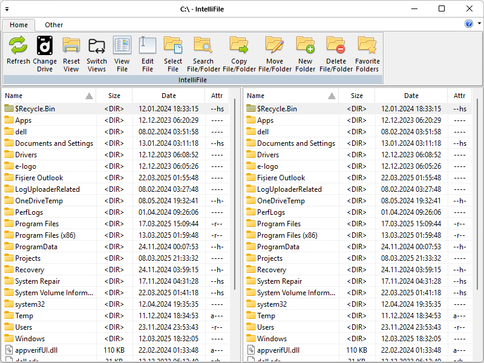

Download:
- [IntelliFileSetup.msi](https://www.moga.doctor/freeware/IntelliFileSetup.msi)
- [IntelliFile.zip](https://www.moga.doctor/freeware/IntelliFile.zip)

## Introduction

_IntelliFile_ is a free (as in “free speech” and also as in “free beer”) file manager. Running in the Microsoft Windows environment, its use is governed by [GNU General Public License v3.0](https://www.gnu.org/licenses/gpl-3.0.html). _IntelliFile_ is written in C++ and uses pure Win32 API and STL which ensures a higher execution speed and smaller program size. By optimizing as many routines as possible without losing user friendliness, _IntelliFile_ is trying to reduce the world carbon dioxide emissions. When using less CPU power, the PC can throttle down and reduce power consumption, resulting in a greener environment. I hope you enjoy _IntelliFile_ as much as I enjoy coding it!

**File handling:**

- Extended copying, moving, renaming and deleting of entire trees.
- ~~Compare files by content, now with built-in text editor.~~
- Encode/Decode files in Base64 format.
- Show/select files with specific search pattern, size, date or contents.
- Enhanced search function with full text search in any files across multiple drives, ~~even inside archives.~~
- ~~Supports Drag & Drop with Explorer/the Desktop.~~

**FTP client:** 

- ~~Built-in FTP client supports most public FTP servers.~~
- ~~Secure FTP over SSL/TLS, enter the URL as follows: ftps://ftp.servername.com~~
- ~~Download in the background (separate thread).~~

**Archive handling:** 

- ~~Archives are handled like subdirectories. You can easily copy files to and from archives.~~
- ~~Built-in ZIP-compatible packer, supports long filenames! This packer is based on ZLIB by Info-Zip.~~
- ~~Pack archives in the background (separate thread).~~

**Some of the above features are still under development!**

## Getting started

### Install IntelliFile using the installer

- Download the installer
- Run the executable binary and follow the installation flow

The installer will likely require Administrative privileges in order to install _IntelliFile_ (and later, to update _IntelliFile_ or install or update plugins, or anything else that requires writing to the installation directory). If you do not have Administrative privileges, you either need to tell the installer to use a location where you do have write permission (though that may still ask for Administrator privileges), or you may choose not use the installer and instead run a portable edition from a directory where you have write permission.

### Install IntelliFile from zip

These instructions will allow you to run a portable or mini-portable (also called “minimalist”), without requiring administrative privileges.

- Create a new folder somewhere that you have write-permission
- Unzip the content into the new folder
- Run _IntelliFile_ from the new folder

The portable zip edition of _IntelliFile_ can be removed by deleting the directory they came in. If you manually set up file associations or context-menu entries in the OS, it is your responsibility to remove them yourself.

## Supported Programming Languages

The following Programming Languages are supported by _IntelliFile_:

- ASP
- Bash
- Batch
- C/C++
- C#
- CMake
- CSS
- Groovy
- HTML
- Java
- JavaScript
- JSON
- Makefile
- Markdown
- MATLAB
- PHP
- Python
- R
- Rust
- SQL
- XML

## Create and Submit your Pull Request

As noted in the [Contributing Rules](https://github.com/mihaimoga/IntelliFile/blob/main/CONTRIBUTING.md) for _IntelliFile_, all Pull Requests need to be attached to a issue on GitHub. So the first step is to create an issue which requests that the functionality be improved (if it was already there) or added (if it was not yet there); in your issue, be sure to explain that you have the functionality definition ready, and will be submitting a Pull Request. The second step is to use the GitHub interface to create the Pull Request from your fork into the main repository. The final step is to wait for and respond to feedback from the developers as needed, until such time as your PR is accepted or rejected.

## Acknowledges

This open source project uses the following libraries:

- René Nyffenegger's [base64](https://github.com/ReneNyffenegger/cpp-base64)
- Armen Hakobyan's [CFolderDialog](https://www.codeproject.com/Articles/2024/CFolderDialog-Selecting-Folders)
- [genUp4win](https://github.com/mihaimoga/genUp4win)
- Jovibor's [HexCtrl](https://github.com/jovibor/HexCtrl)
- PJ Naughter's [CHLinkCtrl](https://www.naughter.com/hlinkctrl.html)
- PJ Naughter's [CInstanceChecker](https://www.naughter.com/sinstance.html)
- [Lexilla, Scintilla, and SciTE](https://www.scintilla.org/)
- PJ Naughter's [CScintillaCtrl, CScintillaDoc, CScintillaView](https://www.naughter.com/scintilla.html)
- PJ Naughter's [CVersionInfo](https://www.naughter.com/versioninfo.html)
- Mizan Rahman's [CWndResizer](https://www.codeproject.com/Articles/125068/MFC-C-Helper-Class-for-Window-Resizing)
