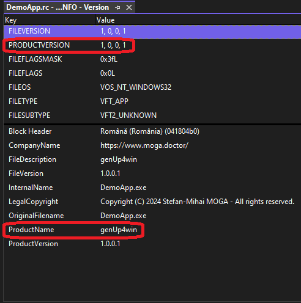
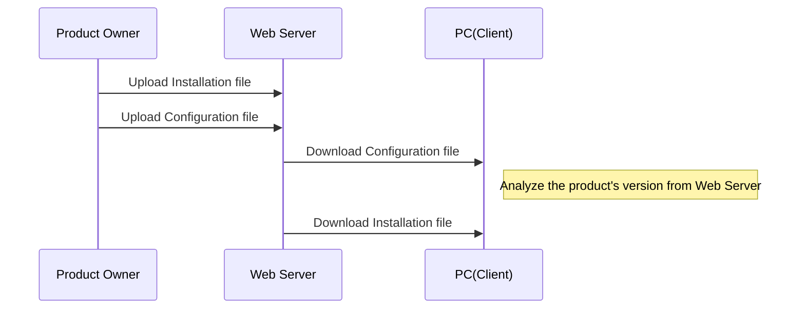

## What is genUp4win?
*genUp4win* is a Generic Updater running under Microsoft Windows environment. The aim of *genUp4win* is to provide a ready to use and configurable updater which downloads a update package then installs it. By using `URLDownloadToFile` function and PJ Naughter's `AppSettings` library, *genUp4win* is capable to deal with **https protocol** and process **XML** data.

## How does it work?
First step is to fill in the **Product Version** (i.e. your own product's version) and the **Product Name** (i.e.the *actual* name of your product) of your program, as in below screenshot:


Second step is to generate the configuration file, using the `WriteConfigFile` function. The result should look like this:
```xml
<?xml version="1.0" encoding="UTF-16" standalone="no"?>
<xml>
    <genUp4win>
        <Version>1.0.0.0</Version>
        <Download>https://www.moga.doctor/freeware/IntelliEditSetup.msi</Download>
    </genUp4win>
</xml>
```

The C++ code to generate the configuration file is:
```cpp
const DWORD nLength = 0x1000 /* _MAX_PATH */;
TCHAR lpszFilePath[nLength] = { 0, };
GetModuleFileName(nullptr, lpszFilePath, nLength);
WriteConfigFile(lpszFilePath, MSI_OR_EXE_INSTALLATION_FILE);
```

**Please upload the configuration file to your Web Server.**

Third step is to check for updates, using the `CheckForUpdates` function.

The C++ code to check for updates is:
```cpp
const DWORD nLength = 0x1000 /* _MAX_PATH */;
TCHAR lpszFilePath[nLength] = { 0, };
GetModuleFileName(nullptr, lpszFilePath, nLength);
g_bNewUpdateFound = CheckForUpdates(lpszFilePath, XML_CONFIGURATION_FILE);
```



*genUp4win* can be launched by your program or manually. It reads from a XML configuration file for getting the current version of your program and url where *genUp4win* gets update information, checks the url (with given current version) to get the update package location, downloads the update package, then run the update package (it should be a **msi** or an **exe**) in question.

## Who will need it?
Being MIT licensed, *genUp4win* can be integrated in both commercial (or close source) and open source project. So if you run a commercial or open a source project under Microsoft Windows and you release your program at regular intervals, then you may need *genUp4win* to notice your users the new update.

## To whom should you say "thank you"?
stefan-mihai[at]moga[dot]doctor

Contributions are welcome. Be mindful of our [Contribution Rules](https://github.com/mihaimoga/genUp4win/blob/main/CONTRIBUTING.md) to increase the likelihood of your contribution getting accepted.
